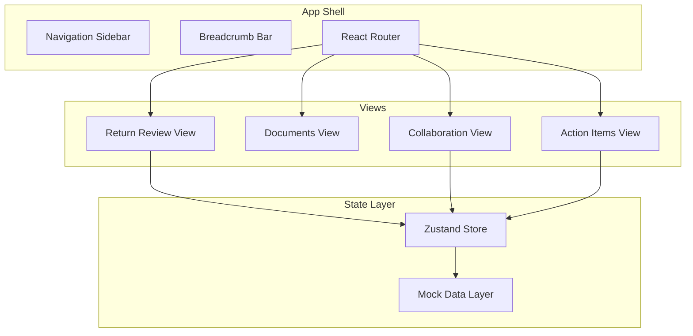
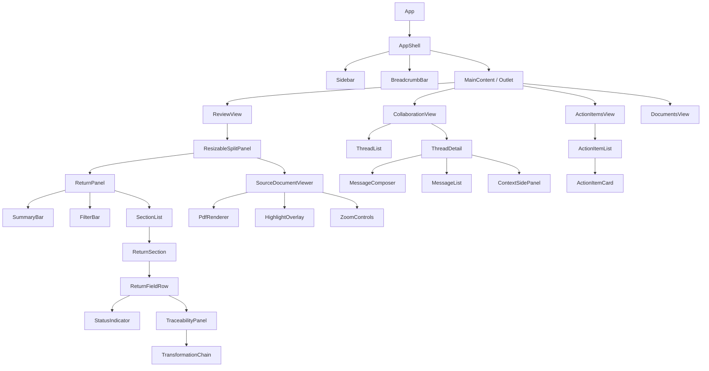

# Design Document: AI Tax Platform Frontend

## Overview

This design describes a single-page application (SPA) for an AI-powered tax platform frontend addressing two core challenges: **Source Document Traceability** and **Client & CPA Collaboration**. The application is frontend-only with all data mocked/hardcoded — no backend is required.

The platform serves two personas:
- **Tax Clients**: Upload documents, respond to action items, and communicate with their CPA.
- **CPAs**: Review tax returns, trace field values to source documents, collaborate with clients, and manage internal notes.

### Key Design Decisions

| Decision | Choice | Rationale |
|----------|--------|-----------|
| Framework | React 18 + TypeScript | Industry standard for complex SPAs; strong typing catches UI logic bugs early |
| Build Tool | Vite | Fast HMR, zero-config TypeScript support, optimal for greenfield projects |
| State Management | Zustand | Lightweight, TypeScript-friendly, avoids Redux boilerplate for a mocked-data app |
| Routing | React Router v6 | Nested routes map well to the breadcrumb/navigation hierarchy |
| Styling | Tailwind CSS + CSS Modules (for complex components) | Utility-first for rapid development; modules for scoped component styles |
| Component Library | Radix UI (headless primitives) | Accessible by default (ARIA, keyboard navigation), unstyled so we control visuals |
| Testing | Vitest + React Testing Library + fast-check | Fast unit/component tests, property-based testing for data logic |
| Document Viewer | PDF.js (via react-pdf) | Standard library for rendering PDFs with highlight overlays |

### Why Not Next.js / Remix?
This is a frontend-only prototype with mocked data. No SSR, no API routes, no SEO requirements. A pure SPA keeps the architecture simple and avoids unnecessary server complexity.

---

## Architecture

### High-Level Architecture



### Application Layers

1. **Presentation Layer** — React components, Radix UI primitives, Tailwind styles
2. **State Layer** — Zustand stores managing UI state, selections, and filters
3. **Data Layer** — Mock data modules exporting typed hardcoded data (returns, documents, threads, action items)
4. **Service Layer** — Thin async wrappers around mock data that simulate loading delays (for skeleton/error state testing)

### Routing Structure

```
/                           → Redirect based on role (CPA → /review, Client → /action-items)
/review                     → Return Review Interface (CPA only)
/review/:fieldId            → Return Review with field pre-selected
/documents                  → Document list and viewer
/documents/:documentId      → Specific document viewer
/collaboration              → Thread list view
/collaboration/:threadId    → Thread detail view
/action-items               → Action items list
```

---

## Components and Interfaces

### Component Hierarchy



### Key Component Interfaces

```typescript
// ResizableSplitPanel
interface ResizableSplitPanelProps {
  leftPanel: React.ReactNode;
  rightPanel: React.ReactNode;
  defaultSplit?: number;        // 0-1, default 0.5
  minLeftPercent?: number;      // default 0.2
  minRightPercent?: number;     // default 0.2
  direction?: 'horizontal' | 'vertical'; // horizontal default, vertical below 768px
}

// ReturnFieldRow
interface ReturnFieldRowProps {
  field: ReturnField;
  isSelected: boolean;
  onSelect: (fieldId: string) => void;
}

// TraceabilityPanel
interface TraceabilityPanelProps {
  chain: TraceabilityChain;
  onSourceSelect: (sourceRef: SourceReference) => void;
}

// TransformationChain
interface TransformationChainProps {
  transformations: Transformation[];
}

// SourceDocumentViewer
interface SourceDocumentViewerProps {
  document: SourceDocument | null;
  highlights: ExtractionHighlight[];
  activeHighlightId?: string;
  scrollToPage?: number;
  zoom: number;
  onZoomChange: (zoom: number) => void;
}

// ThreadDetail
interface ThreadDetailProps {
  thread: Thread;
  currentUserRole: 'cpa' | 'client';
}

// MessageComposer
interface MessageComposerProps {
  defaultMode: MessageMode;
  canSwitchMode: boolean;       // false for clients
  onSend: (content: string, mode: MessageMode) => void;
}

// ActionItemCard
interface ActionItemCardProps {
  item: ActionItem;
  onComplete: (itemId: string) => void;
  onNavigateToThread: (threadId: string) => void;
}

// Sidebar
interface SidebarProps {
  currentPath: string;
  userRole: 'cpa' | 'client';
  openActionItemCount: number;
}

// SummaryBar
interface SummaryBarProps {
  totalFields: number;
  tracedCount: number;
  partialCount: number;
  manualCount: number;
  reviewedCount: number;
}
```

### Accessibility Component Patterns

All interactive components use Radix UI primitives which provide:
- Keyboard navigation (Tab, Enter, Space, Arrow keys)
- ARIA roles, states, and properties
- Focus management and trap prevention
- Screen reader announcements for state changes

Custom additions:
- `FocusRing` wrapper: 2px solid outline with 3:1 contrast ratio on focus-visible
- `StatusBadge`: Always pairs color with icon + text label
- `SkeletonLoader`: Uses `aria-busy="true"` and `aria-label` for loading states

---

## Data Models

### Core Types

```typescript
// === Tax Return & Traceability ===

type FieldStatus = 'traced' | 'partial' | 'manual_entry';

interface ReturnField {
  id: string;
  section: 'income' | 'deductions' | 'credits' | 'tax_computation';
  name: string;                    // e.g., "Line 1 - Wages, salaries, tips"
  value: number;
  status: FieldStatus;
  isReviewed: boolean;
  reviewedBy?: string;
  reviewedAt?: string;             // ISO 8601 timestamp
  traceabilityChain?: TraceabilityChain;
}

interface TraceabilityChain {
  fieldId: string;
  sources: SourceReference[];
  transformations: Transformation[];
}

interface SourceReference {
  documentId: string;
  documentName: string;
  page: number;
  section: string;                 // e.g., "Box 1 - Wages"
  extractedValue: number;
  confidence: number;              // 0-100
  boundingBox: BoundingBox;
}

interface BoundingBox {
  x: number;       // percentage of page width (0-100)
  y: number;       // percentage of page height (0-100)
  width: number;   // percentage
  height: number;  // percentage
}

interface Transformation {
  id: string;
  order: number;
  operation: 'sum' | 'lookup' | 'percentage' | 'subtract' | 'multiply';
  inputs: TransformationInput[];
  output: number;
  formula: string;                 // human-readable, e.g., "W2_1 + W2_2 + 1099_1"
}

interface TransformationInput {
  label: string;
  value: number;
  sourceRef?: SourceReference;     // links back to document
}

// === Source Documents ===

interface SourceDocument {
  id: string;
  name: string;                    // e.g., "W-2 - Acme Corp"
  type: 'w2' | '1099' | 'bank_statement' | '1098' | 'other';
  pageCount: number;
  uploadedAt: string;
  extractionHighlights: ExtractionHighlight[];
}

interface ExtractionHighlight {
  id: string;
  fieldId: string;                 // which return field this maps to
  fieldName: string;
  page: number;
  boundingBox: BoundingBox;
  extractedValue: number | string;
  confidence: number;
  colorIndex: number;              // 0-7, maps to 8-color palette
}

// === Collaboration ===

type ThreadCategory = 'document' | 'field' | 'general';
type MessageMode = 'internal_note' | 'client_message';

interface Thread {
  id: string;
  title: string;                   // max 100 chars
  category: ThreadCategory;
  contextLabel: string;            // document name, field reference, or issue label
  contextId?: string;              // documentId or fieldId if applicable
  createdAt: string;
  lastActivityAt: string;
  messages: Message[];
  unreadCount: number;
  openActionItemCount: number;
}

interface Message {
  id: string;
  threadId: string;
  authorId: string;
  authorName: string;
  authorRole: 'cpa' | 'client';
  mode: MessageMode;
  content: string;
  createdAt: string;
}

// === Action Items ===

type ActionItemStatus = 'open' | 'completed';

interface ActionItem {
  id: string;
  threadId: string;
  description: string;             // max 500 chars
  ownerId: string;
  ownerName: string;
  ownerRole: 'cpa' | 'client';
  status: ActionItemStatus;
  createdAt: string;
  dueDate?: string;
  completedAt?: string;
  completedBy?: string;
}

// === Users ===

type UserRole = 'cpa' | 'client';

interface User {
  id: string;
  name: string;
  role: UserRole;
}

// === UI State ===

interface ReviewState {
  selectedFieldId: string | null;
  expandedSections: string[];
  filter: FieldFilter;
  splitRatio: number;
}

interface FieldFilter {
  statuses: FieldStatus[];
  lowConfidenceOnly: boolean;
  reviewedOnly: boolean;
}

interface CollaborationState {
  selectedThreadId: string | null;
  threadFilter: ThreadFilter;
  composeMode: MessageMode;
}

interface ThreadFilter {
  category: ThreadCategory | 'all';
  showUnreadOnly: boolean;
  showWithOpenActions: boolean;
  attachedDocumentId?: string;
}
```

### Mock Data Service Layer

```typescript
// Services simulate async behavior for loading state testing
interface MockDataService {
  getReturnFields(): Promise<ReturnField[]>;
  getTraceabilityChain(fieldId: string): Promise<TraceabilityChain>;
  getDocument(documentId: string): Promise<SourceDocument>;
  getThreads(filter?: ThreadFilter): Promise<Thread[]>;
  getThread(threadId: string): Promise<Thread>;
  getActionItems(userId?: string): Promise<ActionItem[]>;
  getCurrentUser(): User;
}

// Configurable delay for testing loading/error states
interface MockConfig {
  delayMs: number;          // default 500ms
  shouldFail: boolean;      // default false, for error state testing
  failAfterRetries: number; // default 3, for retry exhaustion testing
}
```

---


## Correctness Properties

*A property is a characteristic or behavior that should hold true across all valid executions of a system — essentially, a formal statement about what the system should do. Properties serve as the bridge between human-readable specifications and machine-verifiable correctness guarantees.*

### Property 1: Split Panel Ratio Clamping

*For any* drag input producing a split ratio value (0 to 1), the clamped output SHALL always be between 0.2 and 0.8 inclusive, and the output SHALL equal the input when the input is already within bounds.

**Validates: Requirements 1.2**

### Property 2: Section Expansion Completeness

*For any* section containing N return fields, when that section is expanded, exactly N field rows SHALL be rendered, and each field's id SHALL appear in the rendered output.

**Validates: Requirements 1.5**

### Property 3: Traceability Chain Completeness

*For any* TraceabilityChain, the rendered display SHALL contain: the Return_Field value, every Source_Document name from its sources, each source's page number and section label, each source's extracted raw value, and for every Transformation in the chain, the formula string and all input values with their labels.

**Validates: Requirements 2.2, 2.3, 3.1, 3.4**

### Property 4: Transformation Sequential Order

*For any* list of Transformations with distinct `order` values, the rendered sequence SHALL display them in ascending order from lowest to highest order value.

**Validates: Requirements 3.2**

### Property 5: Direct vs Computed Badge Assignment

*For any* Return_Field, if its TraceabilityChain contains zero Transformations the field SHALL be badged as "Direct Extraction", and if it contains one or more Transformations the field SHALL be badged as "Computed Value".

**Validates: Requirements 3.3**

### Property 6: Multi-Source Contribution Listing

*For any* Return_Field whose TraceabilityChain references multiple Source_Documents, each source SHALL appear in the rendered list with its individual contribution value, and the set of listed sources SHALL match exactly the sources in the TraceabilityChain.

**Validates: Requirements 2.5**

### Property 7: Highlight Color Distinctness

*For any* set of extraction highlights on a single Source_Document where the count is ≤ 8, each highlight SHALL receive a distinct colorIndex value in the range [0, 7], and no two highlights SHALL share the same colorIndex.

**Validates: Requirements 4.2**

### Property 8: Low-Confidence Warning Threshold

*For any* extraction with a confidence value in [0, 100], the warning indicator SHALL be displayed if and only if confidence < 70.

**Validates: Requirements 4.5**

### Property 9: Zoom Level Clamping

*For any* zoom input value, the resulting zoom level SHALL be clamped to the range [50, 200], and SHALL equal the input when the input is already within bounds.

**Validates: Requirements 4.6**

### Property 10: Field Status Filter Correctness

*For any* set of Return_Fields and any combination of status filters (Partial, Manual Entry, low-confidence), the filtered result set SHALL contain exactly those fields matching at least one selected filter criterion, and no fields that match none.

**Validates: Requirements 5.2**

### Property 11: Summary Bar Computation

*For any* set of Return_Fields, the summary bar SHALL display: a traced percentage equal to (count of 'traced' fields / total fields) × 100 rounded to nearest integer, and counts for each status category that sum to the total field count. After marking a field as reviewed, the reviewed count SHALL increment by exactly one.

**Validates: Requirements 5.3, 5.5**

### Property 12: Input Length Validation

*For any* string input: thread titles SHALL be accepted if and only if length is between 1 and 100 characters inclusive; thread context labels SHALL be accepted if and only if length is between 1 and 120 characters inclusive; action item descriptions SHALL be accepted if and only if length is between 1 and 500 characters inclusive.

**Validates: Requirements 6.1, 8.1**

### Property 13: Thread Grouping and Sort Order

*For any* set of Threads, the thread list SHALL group threads by category (Document, Field, General) and within each group, threads SHALL be sorted by lastActivityAt in descending order (most recent first).

**Validates: Requirements 6.4, 9.1**

### Property 14: Message Visibility by Role

*For any* Thread containing a mix of Internal_Note and Client_Message messages: when viewed by a CPA role, all messages SHALL be visible; when viewed by a Client role, only Client_Message messages SHALL be visible and no gaps or placeholders SHALL indicate hidden messages exist.

**Validates: Requirements 7.4**

### Property 15: Compose Mode Defaults by Role

*For any* user, if their role is 'cpa' the message composer SHALL default to Internal_Note mode with the ability to switch; if their role is 'client' the composer SHALL use Client_Message mode with no option to switch.

**Validates: Requirements 7.3**

### Property 16: Action Items Grouped by Owner with Counts

*For any* set of open Action_Items, the grouped view SHALL partition items by ownerName, and the count displayed next to each owner group SHALL equal the number of items in that group.

**Validates: Requirements 8.3**

### Property 17: Open Action Item Badge Count

*For any* set of Action_Items and a given current user, the sidebar badge count SHALL equal the number of items where status is 'open' AND ownerId matches the current user's id.

**Validates: Requirements 8.5**

### Property 18: Thread Preview Truncation

*For any* message content string, the preview SHALL be: the full string if its length is ≤ 120 characters, or the first 120 characters followed by "…" (ellipsis) if its length exceeds 120 characters.

**Validates: Requirements 9.3**

### Property 19: Thread Action Item Indicator

*For any* Thread, the action item indicator SHALL be displayed if and only if openActionItemCount > 0, and the displayed count SHALL equal openActionItemCount.

**Validates: Requirements 9.4**

### Property 20: Thread Filter Correctness

*For any* set of Threads and any filter (all, unread, with open actions, by document): "all" returns all threads; "unread" returns only threads with unreadCount > 0; "with open actions" returns only threads with openActionItemCount > 0; "by document" returns only threads with the specified attachedDocumentId matching their contextId and category being 'document'.

**Validates: Requirements 9.5**

### Property 21: Breadcrumb Hierarchy Correctness

*For any* valid route path, the breadcrumb SHALL display between 1 and 3 segments, where each segment corresponds to the correct level in the navigation hierarchy (primary section → sub-section → active item).

**Validates: Requirements 10.3**

### Property 22: Navigation Reachability

*For any* pair of primary views (Return Review, Documents, Collaboration, Action Items), a navigation path of at most 2 clicks SHALL exist from the first view to the second view via the sidebar.

**Validates: Requirements 10.5**

### Property 23: Status Indicator Accessibility

*For any* status type (Traced, Partial, Manual Entry, Low Confidence, Reviewed), the rendered indicator SHALL contain both a color-based element AND a non-color element (icon or text label).

**Validates: Requirements 11.5**

### Property 24: Empty State Completeness

*For any* view rendered with zero data items, the empty state SHALL contain a descriptive text message (non-empty string) AND at least one interactive element (button or link).

**Validates: Requirements 12.3**

### Property 25: Retry Exhaustion

*For any* retry attempt count N, the retry button SHALL be enabled if N < 3 and disabled if N ≥ 3. When disabled, a message directing to reload or contact support SHALL be displayed.

**Validates: Requirements 12.5**

---

## Error Handling

### Error Categories and Responses

| Category | Trigger | User-Facing Response | Recovery |
|----------|---------|---------------------|----------|
| Data Load Timeout | Mock service delay > 10s | Skeleton → Error state with retry button | Retry up to 3 times, then show "reload page" message |
| Data Fetch Failure | Mock service configured to fail | Error message describing failure + retry action | Retry up to 3 times |
| Retry Exhaustion | 3 failed retries | Disable retry, show "Reload page or contact support" | Manual page reload |
| Empty State | No data for current view/filter | Descriptive message + actionable next step | Navigate to relevant creation action |
| Invalid Input | Thread title > 100 chars, description > 500 chars | Inline validation error below input field | User corrects input |
| Document Load Failure | PDF fails to render | Placeholder with error message in document panel | Retry or select different document |

### Error State Design Principles

1. **Progressive degradation**: Loading → Skeleton → Content OR Loading → Skeleton → Error
2. **Never leave user stranded**: Every error state includes at least one action (retry, navigate, reload)
3. **Context preservation**: Errors in one panel don't destroy state in other panels (e.g., document viewer error doesn't clear field selection)
4. **No silent failures**: All errors are surfaced visually with clear language

### Retry Logic

```typescript
interface RetryState {
  attemptCount: number;
  maxAttempts: 3;
  isRetrying: boolean;
  lastError: string | null;
}

// State machine: idle → loading → success | error → (retry up to 3) → exhausted
type LoadingPhase = 'idle' | 'loading' | 'success' | 'error' | 'exhausted';
```

---

## Testing Strategy

### Testing Pyramid

```
         ╱─────────╲
        │  E2E (few) │        Cypress/Playwright - full user flows
       ╱───────────────╲
      │ Integration (some)│    Component + store interaction tests
     ╱─────────────────────╲
    │  Property Tests (many)  │  fast-check - universal correctness
   ╱─────────────────────────────╲
  │     Unit Tests (many)           │  Vitest - pure functions, utilities
 ╱─────────────────────────────────────╲
```

### Testing Tools

| Layer | Tool | Purpose |
|-------|------|---------|
| Unit | Vitest | Pure functions: filters, computations, formatters, validators |
| Property | Vitest + fast-check | Universal properties (25 properties from Correctness Properties section) |
| Component | React Testing Library | Component rendering, interaction, accessibility |
| E2E | Playwright | Full user flows across views |
| Accessibility | axe-core + jest-axe | WCAG compliance automated checks |

### Property-Based Testing Configuration

- Library: **fast-check** (TypeScript-native, integrates with Vitest)
- Minimum iterations: **100 per property**
- Each test tagged with: `Feature: ai-tax-platform-frontend, Property {N}: {title}`
- Generators written for all core data types (ReturnField, TraceabilityChain, Thread, ActionItem, Message)

### Test Organization

```
tests/
├── unit/
│   ├── utils/
│   │   ├── clamp.test.ts           # Split ratio, zoom clamping
│   │   ├── truncate.test.ts        # Message preview truncation
│   │   └── validation.test.ts      # Input length validation
│   ├── filters/
│   │   ├── fieldFilter.test.ts     # Field status filtering
│   │   └── threadFilter.test.ts    # Thread filtering logic
│   └── computations/
│       ├── summaryBar.test.ts      # Summary statistics
│       ├── badgeCount.test.ts      # Action item badge count
│       └── breadcrumb.test.ts      # Route to breadcrumb mapping
├── properties/
│   ├── generators/
│   │   ├── returnField.gen.ts      # ReturnField arbitraries
│   │   ├── traceability.gen.ts     # TraceabilityChain arbitraries
│   │   ├── thread.gen.ts           # Thread/Message arbitraries
│   │   └── actionItem.gen.ts       # ActionItem arbitraries
│   ├── clamp.property.test.ts      # Properties 1, 9
│   ├── traceability.property.test.ts  # Properties 3, 4, 5, 6, 7, 8
│   ├── filters.property.test.ts    # Properties 10, 13, 20
│   ├── summary.property.test.ts    # Property 11
│   ├── validation.property.test.ts # Property 12
│   ├── messaging.property.test.ts  # Properties 14, 15
│   ├── actionItems.property.test.ts # Properties 16, 17, 19
│   ├── truncation.property.test.ts # Property 18
│   ├── navigation.property.test.ts # Properties 21, 22
│   ├── accessibility.property.test.ts # Properties 23, 24
│   └── retry.property.test.ts      # Property 25
├── components/
│   ├── ReviewView.test.tsx
│   ├── SplitPanel.test.tsx
│   ├── ThreadDetail.test.tsx
│   ├── MessageComposer.test.tsx
│   └── Sidebar.test.tsx
└── e2e/
    ├── traceability-flow.spec.ts
    ├── collaboration-flow.spec.ts
    └── navigation-flow.spec.ts
```

### Key Testing Strategies

**Unit tests** focus on:
- Edge cases (empty arrays, boundary values, null/undefined handling)
- Specific UI state transitions (mark as reviewed, complete action item)
- Responsive breakpoint behavior

**Property tests** focus on:
- Universal correctness of pure logic (25 properties defined above)
- All filters return correct subsets for any input
- All computations produce correct results for any data
- All clamping functions respect bounds for any input value
- All visibility rules hold for any combination of messages and roles

**Component tests** focus on:
- Correct rendering given props
- User interaction flows (click, type, keyboard navigation)
- Accessibility (axe-core integration per component)
- Loading/error/empty state rendering

**E2E tests** focus on:
- Full user journeys: "CPA selects field → sees traceability → marks reviewed"
- Cross-view navigation: "Create thread from review → find in collaboration"
- Responsive behavior at different viewport sizes
